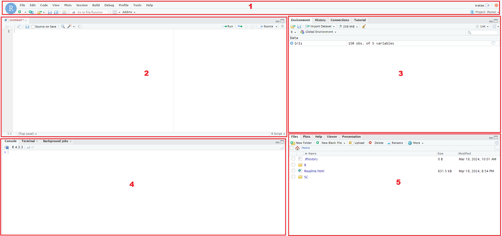
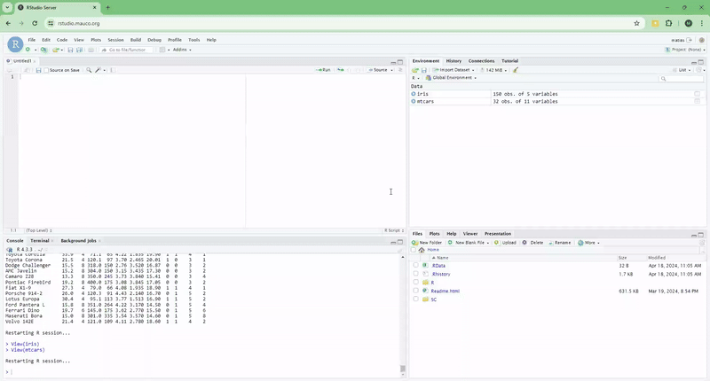

```{r setup, include=FALSE}
knitr::opts_chunk$set(echo = TRUE)
```


# **Manual básico de R.**

Este manual tiene como finalidad ser una guía básica del uso del ambiente Rstudio cloud para los investigadores y/o colaboradores que han solicitado datos pertenecientes a la *Cohorte MAUCO*.

# **Inicio de Sesión en la plataforma.**


Para iniciar sesión en RStudio Cloud, sigue estos pasos:

1. Abre tu navegador web y ve a la página de inicio de [RStudio Cloud MAUCO](https://rstudio.mauco.org/).

2. Una vez en la página de inicio, ingresa tu nombre de usuario en el campo **Username** y tu contraseña en el campo **Password**. 

3. Después de ingresar tu información de inicio de sesión, haz clic en el botón **Sign In** para acceder a tu cuenta.

4. Si la información de inicio de sesión son correctos, se te dirigirá a tu espacio de trabajo en RStudio Cloud, donde podrás acceder a tus proyectos y comenzar a trabajar con los datos solicitados.


# **Entorno RStudio Cloud.**

El entorno de trabajo de RStudio Cloud se subdivide en una serie de secciones o regiones, las cuales se enlistan a continuación y pueden visualizarse en la **Figura 3.1**.

**1. La barra de tareas**  
**2. El editor de scripts (source)**  
**3. Paneles de ambiente e historial**  
**4. La consola**  
**5. Paneles de archivos (files) y gráficos (plots)**  

```{r entorno, echo=FALSE, fig.align = 'center', fig.cap="Figura 3.1: Entorno de trabajo RStudio Cloud.  \n1. Barra de tareas, 2. Editor de Scripts, 3. Paneles de ambiente e historial, 4. Consola, 5. Paneles de archivos y gráficos.", out.width = '2000px'}

```

## **Barra de tareas.**

La barra de herramientas de RStudio se encuentra en la parte superior de la interfaz y proporciona acceso rápido a diversas funciones y herramientas útiles para trabajar con R y proyectos de análisis de datos. A continuación, se presenta una descripción de las principales opciones que puedes encontrar en la barra de tareas:

- File (Archivo): Esta opción te permite realizar operaciones relacionadas con archivos, como crear, abrir y guardar scripts de R, así como abrir proyectos existentes y cerrar sesiones.

- Edit (Edición): Aquí encontrarás opciones para realizar acciones de edición de texto en el editor de scripts, como copiar, pegar, deshacer, rehacer y buscar texto.

- Code (Código): Esta opción proporciona herramientas para trabajar con código, como ejecutar selecciones de código, comentar o descomentar bloques de código, y ajustar el formato del código.

- View (Ver): Te permite cambiar entre diferentes vistas dentro de RStudio, como alternar entre la vista de consola y la vista de scripts, así como mostrar u ocultar diferentes paneles y ventanas.

- Build (Construir): Aquí encontrarás herramientas relacionadas con la construcción de proyectos, como la opción para compilar y cargar paquetes, así como la generación de documentos y la creación de presentaciones.

- Debug (Depurar): Esta opción proporciona herramientas para depurar y rastrear errores en tu código, como establecer puntos de interrupción, ejecutar el código paso a paso y verificar el entorno de ejecución.

- Profile (Perfil): Esta opción te permite acceder y gestionar tu perfil de usuario. 
- Tools (Herramientas): Aquí encontrarás acceso a diversas herramientas adicionales, como el instalador de paquetes, el administrador de conexiones de base de datos, y la terminal de comandos.

- Help (Ayuda): Te proporciona acceso rápido a la documentación y ayuda relacionada con R y RStudio, incluyendo enlaces a la documentación oficial, foros de ayuda y recursos adicionales.

## **Editor de scripts.**

El editor de scripts (Source) en RStudio Cloud es una herramienta central para escribir, editar y ejecutar código en R. 

Con el editor de scripts, podras crear y modificar archivos de script (.R) de manera eficiente, permitiendo una programación estructurada y organizada. Además, el editor facilita la ejecución de código, ya sea línea por línea o en su totalidad, lo que te permitirá probar y depurar su código de manera interactiva.

En resumen, el editor de scripts en RStudio Cloud es una herramienta que facilita el desarrollo y la ejecución de código en R, proporcionando un entorno intuitivo y funcional para trabajar en proyectos de análisis de datos y estadísticas.

## **Ambiente e historial.**

El Ambiente (Environment) y el Historial (History) son dos paneles importantes que ofrecen información y funcionalidades clave para el desarrollo de proyectos en R. 

El panel Ambiente (Environment) muestra información sobre las **variables** y **funciones** que están actualmente cargadas en la sesión de R. Proporciona una visión general de los objetos existentes en el **entorno de trabajo** (Workspace), incluyendo sus *nombres*, *tipos de datos* y *valores actuales*. Este panel es útil para monitorear y gestionar variables durante el desarrollo de un proyecto, lo cual permite inspeccionar y manipular datos en tiempo real.

El panel Historial (History) registra los comandos que han sido ejecutados en la sesión actual de R. Muestra una lista cronológica de los comandos previamente ingresados por el usuario, junto con los resultados correspondientes si los hubiera. Esto facilita la revisión y reproducción de acciones previas, lo que puede ser útil para recordar pasos específicos.

## **Consola.**

La consola en RStudio Cloud es el espacio interactivo donde puedes escribir y ejecutar comandos de R en tiempo real. Es el lugar donde se muestra la salida de los comandos y los mensajes de error, lo que permite a los usuarios interactuar directamente con el lenguaje de programación R.

## **Archivos y gráficos.**

El panel de archivos (files) proporciona una interfaz visual para explorar y gestionar los archivos y directorios en tu proyecto. Te permite navegar por la estructura de archivos, crear nuevos archivos, importar scripts y organizar tu trabajo de manera eficiente. Además, este panel facilita la búsqueda y manipulación de archivos, lo que ayuda a los usuarios a mantener sus proyectos organizados y bien estructurados.

Por otro lado, el panel de gráficos (plots) muestra los gráficos y visualizaciones generados durante tu sesión de R. Es un espacio dedicado para explorar y examinar tus resultados visuales de manera interactiva. Desde este panel, puedes visualizar gráficos y exportar imágenes.

# **Carga de base de datos en el espacio de trabajo.**

Luego de haber iniciado a tu sesión de RStudio CLoud, deberas identificar en el panel de archivos (files) la base datos con la cual realizarás tus futuros análisis. Las bases de datos pueden encontrarse en un sin fin de extensiones de archivos. 

A continuación se explicara como cargar la base de datos en el espacio de trabajo (panel environment) para las extensiones de archivos más utilizadas.

## **Base de datos en archivo con extensión _.RData_**

La extensión `.RData` es una extensión de archivos propia del lenguaje R. Este archivo permite almacenar distintos objetos de R en un solo archivo. En terminos generales, 
todos los elementos que maneja R son objetos, dentro de los cuales pueden ser:

- Valores numéricos
- Vectores
- Matrices
- Funciones
- Bases de datos
- Gráficos
- Entre otros...

Si en su panel de archivos tiene un archivo con extensión `.RData`, puede cargar todos los objetos almacenados en dicho archivo utilizando el siguiente comando

```{r, eval=FALSE}
load("nombre_archivo.Rdata")
```

Así, todos los objetos almacenados en su archivo `.RData`seran cargados en su espacio de trabajo.

## **Base de datos en archivo con extensión _.csv_**

Si dispone de un archivo con extensión `.csv` en su panel de archivos, podra cargarlo en su espacio de trabajo con la función `read.csv()`.

En el siguiente ejemplo, se presenta un caso de uso con la base de datos `penguins.csv`.

```{r}
db_penguins <- read.csv(file = "data/penguins.csv",
                        header = T,
                        sep = ",")
```
```{r, echo=F}
knitr::kable(head(db_penguins), caption = "Base de datos penguins desde archivo .csv", align = "c")
```

La base de datos se almacena en el objeto `db_penguins`. Además, se utilizan tres argumentos de la función `read.csv()`. El argumento `file` permite indicarle a la función la ruta del archivo dentro de nuestro directorio de trabajo. El argumento `header` permite indicarle a la función que nuestra base de datos disponde de encabezados de columna, utilizando un valor booleano T (True). Finalmente, el argumento `sep` permite indicar el signo empleado para la separación de valores dentro del archivo csv.

## **Base de datos en archivo con extensión _.xlsx_**

Para cargar una base de datos con la extensión `.xlsx`, se recomienda el uso de la función `read_xlsx()` de la libreria `readxl`.

Primero, cargue la libreria a su entorno de trabajo. Luego, utilize la función `read_xlsx()` como se muestra en el siguiente ejemplo con la base de datos penguins.


```{r}
library(readxl)

db_penguins <- read_xlsx(path = "data/penguins.xlsx",
                         sheet = "Hoja1")
```
```{r, echo=F}
knitr::kable(head(db_penguins), caption = "Base de datos penguins desde archivo .xlsx")
```

La base de datos se almacena en el objeto `db_penguins`. Además, se utilizan dos argumentos de la función `read_xlsx()`. El argumento `path` permite indicarle a la función la ubicación del archivo dentro del directorio de trabajo. El argumento `sheet` permite especificar el nombre de la hoja del libro en la cual esta almacenada la base de datos.

# **Librerias.**

En R, una "librería" (o "paquete") es un conjunto de funciones y datos que extienden la funcionalidad básica del lenguaje. Estas librerías son creadas por desarrolladores de la comunidad de R y pueden contener herramientas para una amplia gama de tareas, como análisis estadístico, visualización de datos, manipulación de datos, modelado predictivo y más.

Cuando instalas una librería en R, estás agregando nuevas funciones y capacidades a tu entorno de programación. Esto te permite aprovechar el trabajo previo de otros usuarios y acceder a herramientas especializadas para tus proyectos.

Por ejemplo, si estás trabajando en análisis de datos, podrías instalar y cargar la librería "ggplot2" para crear gráficos de alta calidad. O si estás realizando análisis estadístico, podrías usar la librería "dplyr" para manipular y resumir datos de manera eficiente.

Para utilizar una librería en R, primero debes instalarla en tu sistema usando la función install.packages() y luego cargarla en tu sesión de R usando la función library(). Una vez cargada, puedes acceder a las funciones y datos proporcionados por la librería para realizar tareas específicas en tu análisis de datos o proyecto.

Como ejemplo, se instala y carga en el ambiente la libreria dplyr.

```{r libreria, eval=FALSE}
install.packages("dplyr")
library(dplyr)
```


# **Uso y liberación de memoria RAM**

R permite identificar el uso actual de memoria RAM de su ambiente de trabajo. Para esto dirígase a la pestaña **Environment** y seleccione la opción **Memory usage report...** en el icono de gráfico de torta, lo cual abrira un resumen del uso de memoria de su sesión de R como se muestra en la **Figura 6.1**.

```{r memoria, echo=FALSE, fig.align = 'center', fig.cap="Figura 6.1: Uso de memoria asociada a su sesión de trabajo en R", out.width = '800px'}

```

Este uso de memoria corresponde aproximadamente a la suma del tamaño de todos los objetos de R en el entorno global, más las librerias que se han cargado y la sobrecarga interna de R. 

Es posible liberar una porción de memoria del espacio de trabajo cuando no se están utilizando algunos objetos dentro del Environment. Si desea liberar espacio de memoria se recomienda realizar lo siguiente:

1. Crear una imagen del espacio de trabajo de todos los objetos con el comando `save.image(file = "Nombre_archivo.RData")`, donde Nombre_archivo es el nombre que le otorgara a la imagen de su espacio de trabajo.

2. Luego, utilizar la opción **Restart R** la cual se encuentra dentro de la opción **Session** en la barra de tareas, la cual liberara el espacio de memoria de los objetos del espacio de trabajo.


<!-- ## Tab setting {.tabset .tabset-fade .tabset-pills} -->

<!-- ### By Product -->

<!-- (tab content) -->

<!-- ### By Region -->

<!-- (tab content) -->

